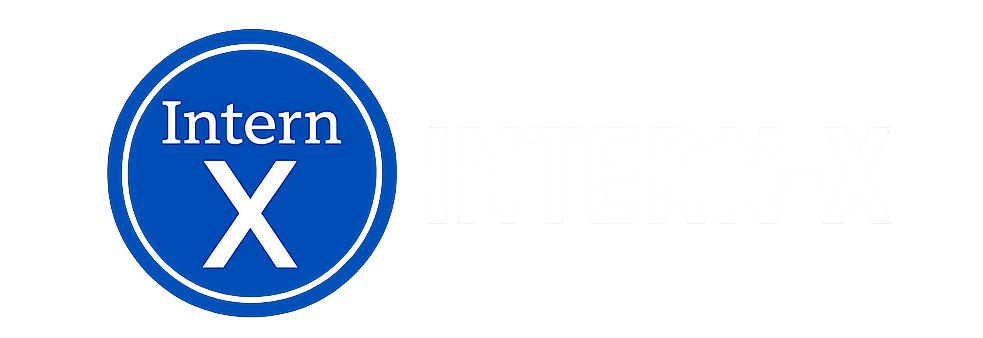

<p align="center">
</img>
</p>

<p align="center">
</img>
</p>  

<p align="center">
  <h1 align="center">InternX</h1>

  <p align="center">
    Building relationships between students and companies through internships. Kickstart your career through projects.
    <br> 
    Developed by WashU students for WashU students.
    <br>
    <a href="https://projx-hbp.web.app" target="_blank">Check out the live demo app!</a>  </p>
</p>

## About

InternX is a platform for students to build their portfolios through internship work. Inspired by LinkedIn, current existing solutions lack the effieicent means to find recruiters and cold email them on the same platform. Our solution is to use Llama for cold email generation for open roles as well as Hunter.io to identify specific recruiters at big companies.

## Our Process 

We were motivated by the great difficulty in finding internship opportunities for the upcoming summers. So, we determined a need for a streamlined system of finding, obtaining roles, and keeping track of our progress. As a result, InternX came to be. We spent the first night planning our idea, including developing our unique “connection” system between companies and students. We also sketched our idea on a whiteboard while researching similar designs. We then whiteboarded the design of our llama stack calls and built from there.

Our team was experienced with ReactJS and Firebase, so we were able to effectively develop during the period. However, our team learned a lot about teamwork and communication in SWE, especially using GitHub as a centralized platform for code management. Furthermore, we learned a lot about the ideation process and how to plan for software with many moving parts (components, personal + company data, cloud hosting, etc). We dealt with an extensive data generation process to mimic full usage on the app, and to demonstrate its full potential with companies and students using the platform. Lastly, we have never used the llama models before so reading through the documentation and implementing features into our application presented a challenge.

## Current Features

- Intern (fake data) listings dashboard for students to explore and apply to
- Personal profile for each student
- Student and company side logins (currently not functioning) to view project listings and application statuses
- Accruate recuiter listed for 20+ companies with confidence intervals for their emails
- Human-like cold + referral emails that generate in under 5 seconds and can be exported instantly to an email client
- LinkedIn scraper of profiles (not fully implemented due to time)


### Future Work

- Make use of the LinkedIn scrapped data
- Partner with real-world companies or scrape data to create real intern postings
- AI-based (collaborative recommender) project recommendations based on your major, interests, and feedback from previous projects 
- GitHub sync for keeping up-to-date with personal projects to showcase under personal information to recruiters

## Contributing

We'd love to have your help in making InternX better. The project still has work to do before the full production launch, but if there's an issue you'd like to see addressed sooner rather than later, feel free to report it in the issues!

<hr>

## Technical

InternX was developed with the FERN + Llama stack during the 2024 HackBeanPot hackathon. The front end is hosted on Firebase, and our back end is hosted on Heroku. Our authentication servies are provided by FirebaseAuth.

### Technologies Used
<div align="center">
  <p align="center"> 
    <a href="https://expressjs.com" target="_blank" rel="noreferrer"> 
       
    </a>
    <a href="https://www.w3schools.com/css/" target="_blank" rel="noreferrer"> 
       
    </a>
    <a href="https://firebase.google.com/" target="_blank" rel="noreferrer"> 
       
    </a>
    <a href="https://www.w3.org/html/" target="_blank" rel="noreferrer"> 
       
    </a>
    <a href="https://developer.mozilla.org/en-US/docs/Web/JavaScript" target="_blank" rel="noreferrer"> 
       
    </a>
    <a href="https://nodejs.org" target="_blank" rel="noreferrer"> 
       
    </a>
    <a href="https://reactjs.org/" target="_blank" rel="noreferrer"> 
       
    </a>
    <a href="https://about.meta.com/" target="_blank" rel="noreferrer">
      
    </a>
  </p>
</div>


### Local Hosting

To run the project locally, you may clone the web-app and server repository. You must have Node version 18+ installed on your machine.

**Web App**
```bash
git clone https://github.com/Intern-X/WebApp.git
```

Then, install the dependencies.

```bash
cd web-app
npm install
```

Finally, run the project.

```bash
npm start
```

Go to `localhost:3000` to view the project.

**Server**
```bash
git clone https://github.com/Intern-X/ProjectServer.git
```

Then, install the dependencies.

```bash
cd server
npm install
```

Finally, run the project.

```bash
node index
```

The server will be listening on port 1000, or the port of your choice.
